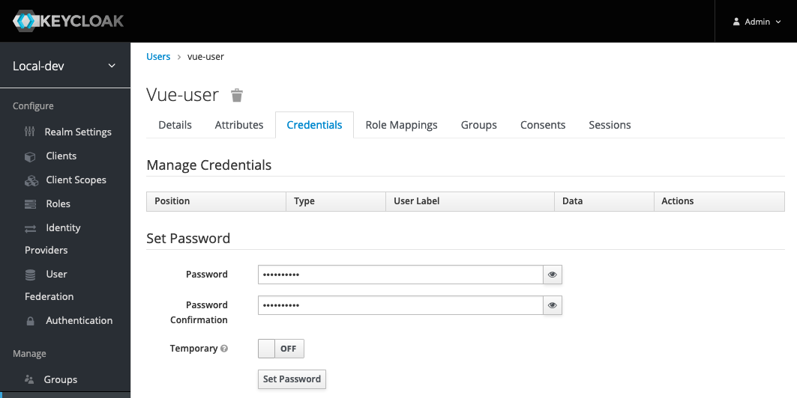

## **Laboratory work №5: Monitoring and troubleshooting**  

*version 02.2023*

### Organizational aspects

- More than one listener can view logs and look for the errors on the environment at the same time. But to restore the environment it is necessary to choose one responsible person from the team;
- The first case is an example which should be done by tutor himself. Then listeners will have a chance to look into the rest cases themselves;
- Listeners have 15 minutes to fix all the problems themselves. If during this time they don't succeed, then it is necessary to explain to them the next step. If after another 15 minutes the team doesn't succeed, then it is necessary to restore the environment independently from the backup and move on to the next case;
- Laboratory work is designed for 4 hours.

### **Preparation** 

1. Connect to the environment via SSH;  
2. Login to the environment and make sure that it is possible to open:
    - [Personal account](https://overcloud.private.x.x.ru);
    - [Super Admin account](https://admin-overcloud.private.x.x.ru);
    - [Zabbix](https://mon-overcloud.private.x.x.ru/zabbix/);
    - [OpenSearch](https://logs-overcloud.private.x.x.ru);
3. Create and delete a virtual machine using your personal account.

If everything works proceed further.

### Case 1 - The synchronization between Keycloak and IAM is broken  

**How to break the synchronization:**
1. Login to the console as admin user (the password is stored in *Inventory* in a variable *xxx_keycloak_password*);
2. Make sure that realm **xxx** is chosen;
3. Go to the **Users** folder, click the button *View all users*;
4. Select the superadmin user, go to the *Credentials* tab;
5. Enter the wrong password, deselect *Temporary*, click the button *Reset password*;
6. Create new user *xxx@xx.team* (*Users -> Add user*). 
7. Go to the new user on the *Credentials* tab, set a password by removing
selection on *Temporary*;
8. Wait one minute, connect to *controller1* via SSH, make sure that a new user has not appeared.

**As a result**: the new user appears in Keycloak, but does not appear in IAM.

Logs message (example):

> 2023-03-12T18:55:00.084069+03:00 controller1 breeze [1215] <err>
> main/146/2:keycloak_sync log.lua:21 E> [_noctx_]> [ALERT_KEYCLOAK_SYNC] 
> Error in fiber sync from keycloack: [500,{"error":"INTERNAL_ERROR" message":"Internal
> Error","debug":"KEYCLOAK did not return valid status. Keycloak status: 401"}]

**How to repair the synchronization:**
- Log into Keycloak console as an admin user. Change back the password of the superadmin user (go through steps 1-5 with a correct password);
- Check IAM logs in OpenSearch (there should be no synchronization errors);
- Make sure that the user *xxx@xx.team* with the {'keycloack_sync': true} 
attribute appears in IAM (step 8).
